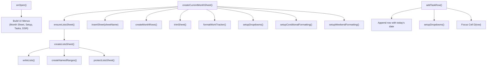

# WorkSheet — Automated Work & Task Tracker for Google Sheets

An automated, modular Google Apps Script solution designed to manage daily tasks, projects, priorities, and statuses directly inside Google Sheets. It provides monthly calendar sheet generation, centralized validation lists with protected reference data, custom typography and layout formatting, conditional formatting for priorities and statuses, weekend row highlights, and custom toolbar menus.

---

## Table of Contents

- [Overview](#overview)
- [Architecture & File Structure](#architecture--file-structure)
- [Installation & Quick Start](#installation--quick-start)
- [Core Features & Usage](#core-features--usage)
  - [1. Monthly Sheet Generation](#1-monthly-sheet-generation)
  - [2. Centralized Lists & Named Ranges](#2-centralized-lists--named-ranges)
  - [3. Dynamic Task Management](#3-dynamic-task-management)
  - [4. Formatting & Visual Hierarchy](#4-formatting--visual-hierarchy)
  - [5. Conditional Formatting & Weekend Highlighting](#5-conditional-formatting--weekend-highlighting)
  - [6. Custom Toolbar Menus](#6-custom-toolbar-menus)
- [Configuration Guide (`01_Config.gs`)](#configuration-guide-01_configgs)
- [Workflow & Call Hierarchy](#workflow--call-hierarchy)
- [Developer Notes & Observations](#developer-notes--observations)

---

## Overview

The **WorkSheet** project transforms a Google Sheet into an organized work-tracking system. Rather than manually copying sheets each month or setting up data validation rules by hand, the script handles sheet creation, dates population for all days in the current month, named ranges, data validation dropdowns, row heights, column widths, and conditional color-coding automatically.

---

## Architecture & File Structure

The project is structured into 11 modular `.gs` files:

```
WorkSheet/
├── 00_Code.gs                  # High-level entry points and orchestration routines
├── 01_Config.gs                # Central configuration for headers, lists, colors, dimensions
├── 02_Utils.gs                 # Helper utilities for timezone, dates, sheet trimming, and ranges
├── 03_Lists.gs                 # Validation reference sheet generator, named ranges, sheet protection
├── 04_MonthSheet.gs            # Monthly sheet creation, day row generation, and layout assembly
├── 05_Tasks.gs                 # Task-level operations (row insertion, dropdown validation, task clearing)
├── 06_Formatting.gs            # Visual layout, font hierarchy, column widths, row heights, borders
├── 07_ConditionalFormatting.gs # Priority, status, and weekend row conditional formatting rules
├── 08_Menu.gs                  # Custom UI menus registered via `onOpen()`
├── 09_DSR.gs                   # Daily Status Report generator, parser, and interactive modal dialog
└── 10_CalendarPicker.gs        # Interactive visual calendar date picker engine for Tasks and DSR
```

### File Responsibilities

| File | Primary Functions | Description |
| :--- | :--- | :--- |
| **`00_Code.gs`** | `initializeWorkTracker`, `setupWorkTracker`, `rebuildLists` | Serves as the operational entry point coordinating setup across modules. |
| **`01_Config.gs`** | `CONFIG` object | Stores global variables, header names, default tasks per day, default colors, and array values for Projects, Categories, Priorities, and Statuses. |
| **`02_Utils.gs`** | `trimSheet`, `getSpreadsheet`, `getTimezone`, `getToday` | Common helper methods for trimming extra grid cells and fetching sheet context with proper timezone handling. |
| **`03_Lists.gs`** | `createListsSheet`, `ensureListsSheet`, `resetListsSheet`, `writeLists`, `formatListsSheet`, `createNamedRanges`, `removeNamedRanges`, `trimListsSheet`, `protectListsSheet`, `removeListsProtection` | Manages the `Lists` sheet which houses dropdown options, generates named ranges consumed by validation rules, trims whitespace, and applies sheet protection. |
| **`04_MonthSheet.gs`** | `createCurrentMonthSheet`, `createMonthRows` | Generates a new sheet for the current month (e.g., `SEP26`), fills each day of the month with default task rows, and applies all styling rules. |
| **`05_Tasks.gs`** | `setupDropdowns`, `createDropdownRule`, `addTaskRow`, `clearTasks` | Applies data validation rules to task rows using named ranges, appends individual task rows with prefilled dates, and resets task content. |
| **`06_Formatting.gs`** | `formatWorkTracker`, `formatHeader`, `formatColumns`, `formatDimensions`, `formatBorders` | Applies typography (`Roboto Mono` for dates/days, `Arial` for content), alignments, column widths, row heights, and borders. |
| **`07_ConditionalFormatting.gs`** | `setupConditionalFormatting`, `textRule`, `setupWeekendFormatting` | Creates color-coded conditional formatting rules for Statuses (In Progress, Completed, Blocked, Cancelled), Priorities (Urgent, High, Medium), and weekend rows (Saturday, Sunday). |
| **`08_Menu.gs`** | `onOpen` | Injects custom menus into Google Sheets UI upon opening: `Month Sheet`, `Setup`, `Tasks`, and `DSR`. |
| **`09_DSR.gs`** | `generateDSRForToday`, `generateDSRForSelectedDate`, `showDSRDialog`, `saveDSRToSheet` | Compiles status reports by project, formats text, and presents interactive modal with date switcher, copy, save, and download actions. |
| **`10_CalendarPicker.gs`** | `openCalendarPicker`, `proceedFromCalendar`, `getCalendarPickerHtml` | Provides an interactive monthly visual calendar widget to visually select dates for Tasks and DSR workflows without text prompts. |

---

## Installation & Quick Start

### 1. Link to Google Sheets
1. Create or open an existing **Google Spreadsheet**.
2. Go to **Extensions** > **Apps Script** in the top menu.
3. Rename the Apps Script project to `WorkSheet`.
4. Copy all 11 `.gs` files into the Apps Script editor with their matching names:
   - `00_Code.gs`
   - `01_Config.gs`
   - `02_Utils.gs`
   - `03_Lists.gs`
   - `04_MonthSheet.gs`
   - `05_Tasks.gs`
   - `06_Formatting.gs`
   - `07_ConditionalFormatting.gs`
   - `08_Menu.gs`
   - `09_DSR.gs`
   - `10_CalendarPicker.gs`

*(Alternatively, use [Google Clasp](https://github.com/google/clasp) to push the local files directly to your Apps Script container).*

### 2. First-Time Setup
1. In the Apps Script editor, select `initializeWorkTracker` from the function dropdown and click **Run**.
2. Grant the required Google Workspace permissions when prompted.
3. The script will:
   - Create and protect the `Lists` sheet with all configured dropdown options and named ranges.
   - Create the current month's tracker sheet (e.g., `SEP26`).
   - Populate all days of the month with task rows.
   - Apply cell formatting, column widths, row heights, dropdown validations, and conditional color highlights.
4. Refresh the Google Sheet tab. The custom menus (`Month Sheet`, `Setup`, `Tasks`, `DSR`) will appear in the top toolbar.

---

## Core Features & Usage

### 1. Monthly Sheet Generation
- **Trigger**: Click **Month Sheet** > **Create Current Month**.
- **Behavior**:
  - Automatically calculates the sheet name using the pattern `MMMyy` (e.g. `SEP26`, `OCT26`).
  - Checks if the sheet already exists to prevent accidental overwriting.
  - Automatically ensures the `Lists` sheet exists before generating month data.
  - Creates rows for all days in the month (e.g., 28 to 31 days) with `CONFIG.DEFAULT_TASKS_PER_DAY` tasks per day.
  - Default status for all rows is set to `Pending`. The `Notes` column is omitted for maximum speed and simplicity.
  - Trims all unused columns (beyond column G) and unused rows to maintain high sheet performance.
  - Freezes the header row.

### 2. Centralized Lists & Named Ranges
- All dropdown options are stored in the `Lists` sheet.
- **Named Ranges Created**:
  - `Projects` (Column A)
  - `Categories` (Column B)
  - `Priorities` (Column C)
  - `Statuses` (Column D)
- **Protection**: The `Lists` sheet is automatically trimmed to fit exact list items and locked against editing to prevent accidental alterations.

### 3. Dynamic Task Management & Quick Entry
- **Fill Task for Today**:
  - Menu: **Tasks** > **Fill task for today**.
  - Opens a streamlined, interactive modal dialog pre-set to today's date.
  - Select your **Project**, **Category**, and **Priority** once.
  - Status is automatically **Pending** (no input needed).
  - Notes are not requested, keeping input friction to zero.
  - Enter or paste one or multiple tasks in the textarea (supports bullet points, dashes, or numbered lists).
  - Use **Ctrl + Enter** to quickly submit.
  - Click **+ Add & Next Project** to save tasks and immediately log tasks for another project without closing the dialog.
  - The script automatically writes the first task into the existing date row and inserts additional rows below it with the same Date and Day, complete with borders, fonts, and dropdown validations.
- **Fill Task for Selected Date in the Current Month**:
  - Menu: **Tasks** > **Fill task for selected date in the current month**.
  - Opens a visual, interactive monthly calendar picker where you can click any day (or double-click to proceed immediately) to enter tasks for that date.
  - You can also switch days directly inside the Task Entry dialog via the embedded calendar date picker.

### 4. Formatting & Visual Hierarchy
- **Header**: Background color `#d9ead3` (soft green), bold Arial text, centered, height 28px.
- **Date & Day (Columns A & B)**: Monospaced `Roboto Mono`, bold, centered.
- **Project (Column C)**: Centered, width 130px.
- **Task (Column D)**: Left-aligned, width 340px, text wrapped.
- **Category, Priority, Status (Columns E, F, G)**: Centered, data-validation dropdowns.
- **Data Rows**: Uniform row height of 42px with `#d9d9d9` solid borders.

### 5. Conditional Formatting & Weekend Highlighting
- **Priorities (Column F)**:
  - `Urgent`: Red text (`#ff0000`) on light red background (`#fce8e6`)
  - `High`: Dark orange text (`#b45f06`) on light yellow background (`#fff2cc`)
  - `Medium`: Olive text (`#7f6000`) on light yellow background (`#fff2cc`)
- **Statuses (Column G)**:
  - `In Progress`: Blue text (`#1155cc`) on soft blue background (`#cfe2f3`)
  - `Completed`: Green text (`#008000`) on soft green background (`#d9ead3`)
  - `Blocked`: Red text (`#cc0000`) on soft red background (`#f4cccc`)
  - `Cancelled`: Grey text (`#666666`) on light grey background (`#eeeeee`)
- **Weekend Rows (Columns A to G)**:
  - `Saturday`: Grey text (`#6b7280`) on light grey background (`#f3f4f6`)
  - `Sunday`: Red text (`#cc0000`) on soft red background (`#fce8e6`)

### 6. Custom Toolbar Menus

| Menu | Item | Target Function | Description |
| :--- | :--- | :--- | :--- |
| **Month Sheet** | Create Current Month | `createCurrentMonthSheet` | Generates the current month sheet with days, default Pending statuses, and styling. |
| **Setup** | Create Lists Sheet | `createListsSheet` | Resets and rebuilds the reference Lists sheet and named ranges. |
| **Tasks** | Fill task for today | `fillTaskForToday` | Opens the fast modal dialog to enter single/multiple tasks for today by project, category, and priority. |
| **Tasks** | Fill task for selected date in the current month | `fillTaskForSelectedDate` | Opens the visual interactive calendar to choose any date, then opens the task entry dialog with automatic Pending status. |
| **DSR** | Generate DSR for today | `generateDSRForToday` | Opens an interactive modal dialog showing today's status report formatted by project with options to copy to clipboard, save to sheet, or download `.txt`. |
| **DSR** | Generate DSR for selected date in the month | `generateDSRForSelectedDate` | Opens the visual interactive calendar to choose any date and generate the DSR, with in-modal date switching support. |

---

## Configuration Guide (`01_Config.gs`)

Modify `01_Config.gs` to tailor the tracker to your organization's workflow:

```javascript
const CONFIG = {
  HEADER_ROW: 1,
  DATE_FORMAT: 'MMdd',
  DEFAULT_TASKS_PER_DAY: 1,      // Number of rows generated per day
  LISTS_SHEET_NAME: 'Lists',     // Name of reference sheet

  HEADERS: [
    'Date', 'Day', 'Project', 'Task', 'Category', 'Priority', 'Status'
  ],

  COLORS: {
    HEADER: '#d9ead3',
    BORDER: '#d9d9d9'
  },

  LISTS: {
    Projects: [
      'Clinkio', 'Surfari', 'Workbench', 'Memryx', 'DroidLens', 'Other'
    ],
    Categories: [
      'Development', 'Bug Fix', 'UI/UX', 'API', 'Testing',
      'Research', 'Deployment', 'Meeting', 'Other'
    ],
    Priorities: [
      'Low', 'Medium', 'High', 'Urgent'
    ],
    Statuses: [
      'Pending', 'In Progress', 'Blocked', 'Completed', 'Cancelled'
    ]
  }
};
```

> **Note**: After modifying values inside `CONFIG.LISTS`, execute **Setup** > **Create Lists Sheet** or call `rebuildLists()` to update the `Lists` sheet and refresh the named ranges.

---

## Workflow & Call Hierarchy



---

## Developer Notes & Observations

1. **Date Format Alignment**:
   `04_MonthSheet.gs` formats dates as `'MMdd'` (e.g., `0908`), whereas `addTaskRow()` in `05_Tasks.gs` formats dates as `'ddMMM'` (e.g., `08SEP`). For visual consistency across rows, it is recommended to standardize on a single date format across both files.
2. **Column Index Flexibility**:
   Validation rules in `05_Tasks.gs` map hardcoded column indices (3, 5, 6, 7). If headers in `01_Config.gs` are reordered or added, ensure column indices in `05_Tasks.gs`, `06_Formatting.gs`, and `07_ConditionalFormatting.gs` are synchronized.
