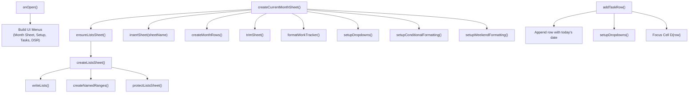

# WorkSheet — Automated Work & Task Tracker for Google Sheets

An automated, modular Google Apps Script solution designed to manage daily tasks, projects, priorities, and statuses directly inside Google Sheets. It provides monthly calendar sheet generation, centralized validation lists with protected reference data, custom typography and layout formatting, conditional formatting for priorities and statuses, weekend row highlights, and custom toolbar menus.

---

## Table of Contents

- [Overview](#overview)
- [Architecture & File Structure](#architecture--file-structure)
- [Installation & Quick Start](#installation--quick-start)
- [Core Features & Usage](#core-features--usage)
  - [1. Monthly Sheet Generation](#1-monthly-sheet-generation)
  - [2. Centralized Lists & Named Ranges](#2-centralized-lists--named-ranges)
  - [3. Dynamic Task Management](#3-dynamic-task-management)
  - [4. Formatting & Visual Hierarchy](#4-formatting--visual-hierarchy)
  - [5. Conditional Formatting & Weekend Highlighting](#5-conditional-formatting--weekend-highlighting)
  - [6. Custom Toolbar Menus](#6-custom-toolbar-menus)
- [Configuration Guide (`Config.gs`)](#configuration-guide-configgs)
- [Workflow & Call Hierarchy](#workflow--call-hierarchy)
- [Developer Notes & Observations](#developer-notes--observations)

---

## Overview

The **WorkSheet** project transforms a Google Sheet into an organized work-tracking system. Rather than manually copying sheets each month or setting up data validation rules by hand, the script handles sheet creation, dates population for all days in the current month, named ranges, data validation dropdowns, row heights, column widths, and conditional color-coding automatically.

---

## Architecture & File Structure

The project is structured into 10 modular `.gs` files:

```
WorkSheet/
├── Config.gs                 # Central configuration for headers, lists, colors, dimensions
├── Code.gs                   # High-level entry points and orchestration routines
├── MonthSheet.gs             # Monthly sheet creation, day row generation, and layout assembly
├── Tasks.gs                  # Task-level operations (row insertion, dropdown validation, task clearing)
├── Lists.gs                  # Validation reference sheet generator, named ranges, sheet protection
├── Formatting.gs             # Visual layout, font hierarchy, column widths, row heights, borders
├── ConditionalFormatting.gs  # Priority, status, and weekend row conditional formatting rules
├── Menu.gs                   # Custom UI menus registered via `onOpen()`
├── DSR.gs                    # Daily Status Report generator, parser, and interactive modal dialog
└── Utils.gs                  # Helper utilities for timezone, dates, sheet trimming, and ranges
```

### File Responsibilities

| File | Primary Functions | Description |
| :--- | :--- | :--- |
| **`Config.gs`** | `CONFIG` object | Stores global variables, header names, default tasks per day, default colors, and array values for Projects, Categories, Priorities, and Statuses. |
| **`Code.gs`** | `initializeWorkTracker`, `setupWorkTracker`, `rebuildLists`, `formatCurrentSheet` | Serves as the operational entry point coordinating setup across modules. |
| **`MonthSheet.gs`** | `createCurrentMonthSheet`, `createMonthRows` | Generates a new sheet for the current month (e.g., `SEP26`), fills each day of the month with default task rows, and applies all styling rules. |
| **`Tasks.gs`** | `setupDropdowns`, `createDropdownRule`, `addTaskRow`, `clearTasks` | Applies data validation rules to task rows using named ranges, appends individual task rows with prefilled dates, and resets task content. |
| **`Lists.gs`** | `createListsSheet`, `ensureListsSheet`, `resetListsSheet`, `writeLists`, `formatListsSheet`, `createNamedRanges`, `removeNamedRanges`, `trimListsSheet`, `protectListsSheet`, `removeListsProtection` | Manages the `Lists` sheet which houses dropdown options, generates named ranges consumed by validation rules, trims whitespace, and applies sheet protection. |
| **`Formatting.gs`** | `formatWorkTracker`, `formatHeader`, `formatColumns`, `formatDimensions`, `formatBorders` | Applies typography (`Roboto Mono` for dates/days, `Arial` for content), alignments, column widths, row heights, and borders. |
| **`ConditionalFormatting.gs`** | `setupConditionalFormatting`, `textRule`, `setupWeekendFormatting` | Creates color-coded conditional formatting rules for Statuses (In Progress, Completed, Blocked, Cancelled), Priorities (Urgent, High, Medium), and weekend rows (Saturday, Sunday). |
| **`Menu.gs`** | `onOpen` | Injects custom menus into Google Sheets UI upon opening: `Month Sheet`, `Setup`, `Tasks`, and `DSR`. |
| **`DSR.gs`** | `generateDSRForToday`, `generateDSRForSelectedDate`, `showDSRDialog`, `saveDSRToSheet` | Compiles status reports by project, formats text, and presents interactive modal with copy, save, and download actions. |
| **`Utils.gs`** | `trimSheet`, `getSpreadsheet`, `getTimezone`, `getToday` | Common helper methods for trimming extra grid cells and fetching sheet context with proper timezone handling. |

---

## Installation & Quick Start

### 1. Link to Google Sheets
1. Create or open an existing **Google Spreadsheet**.
2. Go to **Extensions** > **Apps Script** in the top menu.
3. Rename the Apps Script project to `WorkSheet`.
4. Copy all 9 `.gs` files into the Apps Script editor with their matching names:
   - `Config.gs`
   - `Code.gs`
   - `MonthSheet.gs`
   - `Tasks.gs`
   - `Lists.gs`
   - `Formatting.gs`
   - `ConditionalFormatting.gs`
   - `Menu.gs`
   - `Utils.gs`

*(Alternatively, use [Google Clasp](https://github.com/google/clasp) to push the local files directly to your Apps Script container).*

### 2. First-Time Setup
1. In the Apps Script editor, select `initializeWorkTracker` from the function dropdown and click **Run**.
2. Grant the required Google Workspace permissions when prompted.
3. The script will:
   - Create and protect the `Lists` sheet with all configured dropdown options and named ranges.
   - Create the current month's tracker sheet (e.g., `SEP26`).
   - Populate all days of the month with task rows.
   - Apply cell formatting, column widths, row heights, dropdown validations, and conditional color highlights.
4. Refresh the Google Sheet tab. The custom menus (`Month Sheet`, `Setup`, `Tasks`, `DSR`) will appear in the top toolbar.

---

## Core Features & Usage

### 1. Monthly Sheet Generation
- **Trigger**: Click **Month Sheet** > **Create Current Month**.
- **Behavior**:
  - Automatically calculates the sheet name using the pattern `MMMyy` (e.g. `SEP26`, `OCT26`).
  - Checks if the sheet already exists to prevent accidental overwriting.
  - Automatically ensures the `Lists` sheet exists before generating month data.
  - Creates rows for all days in the month (e.g., 28 to 31 days) with `CONFIG.DEFAULT_TASKS_PER_DAY` tasks per day.
  - Trims all unused columns (beyond column H) and unused rows to maintain high sheet performance.
  - Freezes the header row.

### 2. Centralized Lists & Named Ranges
- All dropdown options are stored in the `Lists` sheet.
- **Named Ranges Created**:
  - `Projects` (Column A)
  - `Categories` (Column B)
  - `Priorities` (Column C)
  - `Statuses` (Column D)
- **Protection**: The `Lists` sheet is automatically trimmed to fit exact list items and locked against editing to prevent accidental alterations.

### 3. Dynamic Task Management
- **Add Task Row**:
  - Menu: **Tasks** > **Add Task Row**.
  - Appends a new task row for today's date at the end of the active sheet.
  - Automatically configures dropdown validations, wraps text, sets row height to 42px, and focuses the cursor directly on the **Task** column (Column D) for immediate typing.
- **Clear Tasks**:
  - Menu: **Tasks** > **Clear Tasks**.
  - Displays a confirmation prompt.
  - Clears task data (columns Project through Notes) from row 2 downwards while preserving dates, days, and resetting status to `Pending`.

### 4. Formatting & Visual Hierarchy
- **Header**: Background color `#d9ead3` (soft green), bold Arial text, centered, height 28px.
- **Date & Day (Columns A & B)**: Monospaced `Roboto Mono`, bold, centered.
- **Project (Column C)**: Centered, width 130px.
- **Task (Column D)**: Left-aligned, width 315px, text wrapped.
- **Category, Priority, Status (Columns E, F, G)**: Centered, data-validation dropdowns.
- **Notes (Column H)**: Left-aligned, width 300px, text wrapped.
- **Data Rows**: Uniform row height of 42px with `#d9d9d9` solid borders.

### 5. Conditional Formatting & Weekend Highlighting
- **Priorities (Column F)**:
  - `Urgent`: Red text (`#ff0000`) on light red background (`#fce8e6`)
  - `High`: Dark orange text (`#b45f06`) on light yellow background (`#fff2cc`)
  - `Medium`: Olive text (`#7f6000`) on light yellow background (`#fff2cc`)
- **Statuses (Column G)**:
  - `In Progress`: Blue text (`#1155cc`) on soft blue background (`#cfe2f3`)
  - `Completed`: Green text (`#008000`) on soft green background (`#d9ead3`)
  - `Blocked`: Red text (`#cc0000`) on soft red background (`#f4cccc`)
  - `Cancelled`: Grey text (`#666666`) on light grey background (`#eeeeee`)
- **Weekend Rows (Columns A to H)**:
  - `Saturday`: Grey text (`#6b7280`) on light grey background (`#f3f4f6`)
  - `Sunday`: Red text (`#cc0000`) on soft red background (`#fce8e6`)

### 6. Custom Toolbar Menus

| Menu | Item | Target Function | Description |
| :--- | :--- | :--- | :--- |
| **Month Sheet** | Create Current Month | `createCurrentMonthSheet` | Generates the current month sheet with days and styling. |
| **Setup** | Create Lists Sheet | `createListsSheet` | Resets and rebuilds the reference Lists sheet and named ranges. |
| **Setup** | Format Current Sheet | `formatCurrentSheet` | Re-applies fonts, column widths, dropdowns, and formatting. |
| **Tasks** | Add Task Row | `addTaskRow` | Adds an additional row for today's date. |
| **Tasks** | Clear Tasks | `clearTasks` | Clears task entries and resets statuses to Pending. |
| **DSR** | Generate DSR for today | `generateDSRForToday` | Opens an interactive modal dialog showing today's status report formatted by project with options to copy to clipboard, save to sheet, or download `.txt`. |
| **DSR** | Generate DSR for selected date in the month | `generateDSRForSelectedDate` | Generates the status report for a selected row's date or user-entered date in a modal dialog. |

---

## Configuration Guide (`Config.gs`)

Modify `Config.gs` to tailor the tracker to your organization's workflow:

```javascript
const CONFIG = {
  HEADER_ROW: 1,
  DEFAULT_TASKS_PER_DAY: 1,      // Number of rows generated per day
  LISTS_SHEET_NAME: 'Lists',     // Name of reference sheet

  HEADERS: [
    'Date', 'Day', 'Project', 'Task', 'Category', 'Priority', 'Status', 'Notes'
  ],

  COLORS: {
    HEADER: '#d9ead3',
    BORDER: '#d9d9d9'
  },

  LISTS: {
    Projects: [
      'Clinkio', 'Surfari', 'Workbench', 'Memryx', 'DroidLens', 'Other'
    ],
    Categories: [
      'Development', 'Bug Fix', 'UI/UX', 'API', 'Testing',
      'Research', 'Deployment', 'Meeting', 'Other'
    ],
    Priorities: [
      'Low', 'Medium', 'High', 'Urgent'
    ],
    Statuses: [
      'Pending', 'In Progress', 'Blocked', 'Completed', 'Cancelled'
    ]
  }
};
```

> **Note**: After modifying values inside `CONFIG.LISTS`, execute **Setup** > **Create Lists Sheet** or call `rebuildLists()` to update the `Lists` sheet and refresh the named ranges.

---

## Workflow & Call Hierarchy



---

## Developer Notes & Observations

1. **Date Format Alignment**:
   `MonthSheet.gs` formats dates as `'MMdd'` (e.g., `0908`), whereas `addTaskRow()` in `Tasks.gs` formats dates as `'ddMMM'` (e.g., `08SEP`). For visual consistency across rows, it is recommended to standardize on a single date format across both files.
2. **Format Current Sheet**:
   `formatCurrentSheet()` in `Code.gs` reapplies fonts, dropdowns, and status/priority formatting, but does not currently invoke `setupWeekendFormatting()`. Calling `setupWeekendFormatting(sheet)` inside `formatCurrentSheet` ensures weekends are styled when manually reformatting.
3. **Column Index Flexibility**:
   Validation rules in `Tasks.gs` map hardcoded column indices (3, 5, 6, 7). If headers in `Config.gs` are reordered or added, ensure column indices in `Tasks.gs`, `Formatting.gs`, and `ConditionalFormatting.gs` are synchronized.
